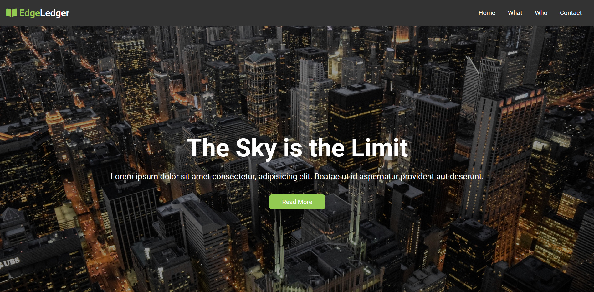

# EdgeLedger Website Template
This is a free Website template and is perfect for practicing your Html and Css skills

## Author 
> Nishkarsh01

## Screenshots 📷

## Live Demo 

 [https://nishkarsh01.github.io/Edge-Ledger-Practice-Template/](https://nishkarsh01.github.io/Edge-Ledger-Practice-Template/)

## Developed Using 💻

+ [Html](https://developer.mozilla.org/en-US/docs/Web/HTML)
+ [Css](https://developer.mozilla.org/en-US/docs/Web/CSS)
+ [Bootstrap](https://getbootstrap.com/)
+ [Javascript](https://developer.mozilla.org/en-US/docs/Web/javascript)

## Installation or Getting Started

Run the following command in the terminal:

	git clone https://github.com/Nishkarsh01/Edge-Ledger-Practice-Template.git
or download the zip file from github.
    

## Usage
After extracting the files,

    cd Edge-Ledger-Practice-Template
    and, simply open the index.html file
    
## Collaborate
To collaborate, reach me on [nishdubb11@gmail.com]() 

